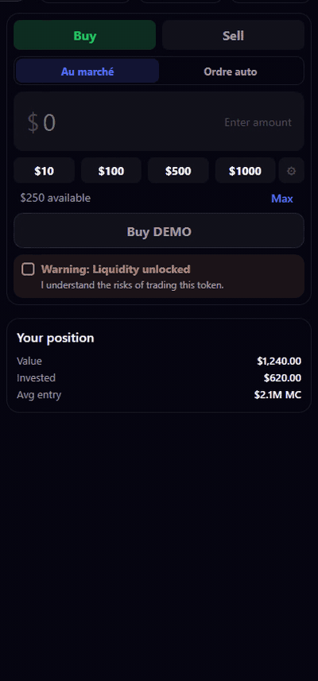
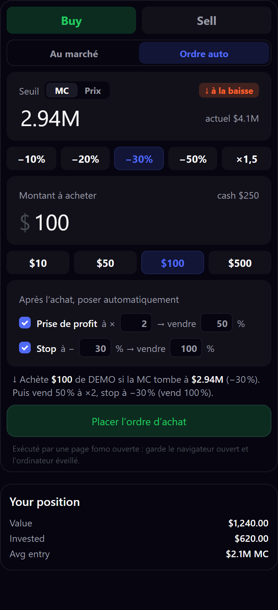
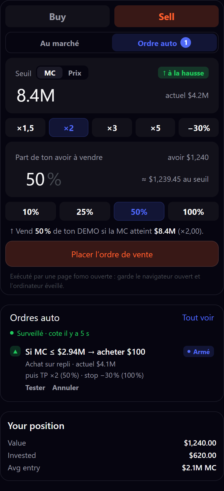
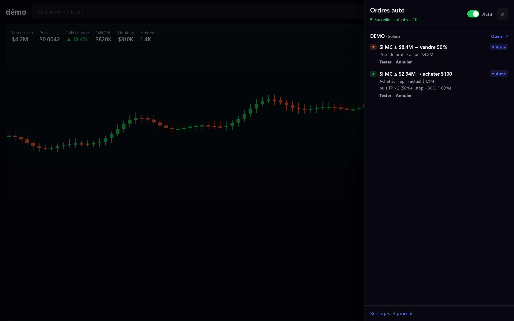

# Auto Orders for fomo.family — take profit, stop loss & limit buys, inside the app

**fomo.family has no limit orders.** You either sit in front of the chart, or you miss your exit.
This browser extension adds **take-profit, stop-loss and limit buy orders** directly into the
fomo.family trade panel — same look, same buttons, one click away.

You set a market cap (or price) trigger, it watches the market for you and clicks Buy or Sell in
your own fomo session when the level is hit. No API keys, no private keys, no server: everything
stays in your browser.

<p align="center">
  
</p>

> ⚠️ Unofficial, community-built tool. Not affiliated with, endorsed by, or connected to
> fomo.family. Automating your account may conflict with their terms of service. Use at your own
> risk — crypto trading can lose you money.

---

## What it does

| | |
|---|---|
| 🎯 **Take profit** | *Sell 25% when market cap reaches $5M.* Stack several levels on one token. |
| 🛡️ **Stop loss** | *Sell everything if it drops to $800K* — with a confirmation delay so a 5-second wick doesn't dump your bag. |
| 🛒 **Limit buy (dip)** | *Buy $100 if market cap falls to $1.5M.* |
| 🚀 **Breakout buy** | *Buy $100 if it breaks above $3M.* |
| 🔗 **Attached exits** | A buy order can place its own take profit (×2) and stop (−30%) automatically, relative to your real fill. |
| 🗂️ **Many tokens at once** | Watch as many tokens as you like — they are all quoted in the same batched call, and orders that trigger together are executed one after another, each on its own token. |
| 🖥️ **Native UI** | A "Market / Auto order" switch under fomo's own Buy/Sell tabs. Same palette, same sizing, motion included. |
| 📱 **Telegram alerts** | Triggers, fills and failures pushed to your phone — because a Windows notification is useless at 3 a.m. |
| 🧪 **Dry-run mode** | Every step except the final click, so you can verify before trusting it with real money. |

## Screenshots

| Buy order with attached exits | Sell order | All your orders |
|---|---|---|
|  |  |  |

*Screenshots taken on a demo page with fictional numbers (`demo/page-demo.html`).*

## Install (2 minutes)

1. **[⬇️ Download the latest release (ZIP)](../../releases/latest)** and unzip it anywhere.
2. Open `chrome://extensions` (or `brave://extensions`).
3. Turn on **Developer mode** (top right).
4. Click **Load unpacked** and select the unzipped folder (the one containing `manifest.json`).
5. Reload any fomo.family tab you already had open.

No build step, no bundler, no runtime dependency — it is plain JavaScript.

> **Why isn't it one click?** Chrome and Brave only allow one-click installs from the Chrome Web
> Store; a `.crx` downloaded from GitHub is blocked by the browser itself. A Web Store listing is
> planned — ⭐ star the repo to get pinged when it lands.

To update later: download the new ZIP, replace the folder, then hit ⟳ on the extension card.

## How to place an order

1. Open a token page on fomo.family and pick **Buy** or **Sell** as usual.
2. Click **Ordre auto** (auto order) under the tabs.
3. Type a threshold — `1.5M`, `500k`, `0.004` — or hit a shortcut (`−20%`, `×2`, `×3`…).
   - Threshold **below** the current value → triggers on the way down (dip buy, stop loss).
   - Threshold **above** → triggers on the way up (breakout buy, take profit).
4. Choose the dollar amount (buy) or the percentage of your bag (sell), then place the order.

The summary line spells out exactly what will happen before you confirm.

## How it works

- A background worker quotes your tokens every 3 seconds through fomo's own API, using the session
  already open in your browser. **One call covers every token you watch** (batched by 25), so ten
  orders on ten tokens cost the same as one.
- When a threshold is crossed, it opens a fresh tab on the token, drives fomo's real trade panel
  (tab → amount → quote → risk checkboxes you allowed → confirm) and closes it.
- **One trade at a time.** If several orders trigger in the same move, they queue up and run in
  order — and each one re-checks its own threshold on the way out of the queue, so an order whose
  level no longer holds is re-armed instead of executed late.
- Success is confirmed by **reading your token balance before and after** — not by a toast message.
- If the click went through but the balance never moved, the order is marked *failed, needs
  checking*. It is **never retried**, so you can't buy or sell twice by accident.

### Safety rules baked in

- Orders never fire on a stale quote (older than 60 seconds).
- fomo's minimums are enforced **before** you create the order ($2 per trade, $25 buy / $5 sell on
  Ethereum), including the value of attached exits.
- High price impact (≥ 25%) and high relay fees are blocked unless you explicitly allow them.
- An interface self-check runs every 6 hours: if fomo changes its UI, you get told **before** an
  order depends on it.
- Session dead? You get an alert, repeated every 6 hours while an order is still waiting.

## Honest limitations

- **Your browser must stay open and your computer awake.** Closing a fomo tab is fine (the
  extension reopens one), closing the browser is not.
- Quotes refresh in seconds, not milliseconds. On a violent move, you get the price at execution,
  not exactly your threshold.
- It drives fomo's interface. If fomo renames a button, execution stops cleanly and warns you
  instead of clicking at random.
- The in-app interface is currently **in French** (English is planned).

## Settings

Extension icon → settings: dry-run mode, which risk warnings may be accepted, polling interval,
retry count, balance-confirmation window, Telegram alerts, and a log of the last 200 events.

## For developers

```bash
npm install          # dev dependencies only (vitest, eslint)
npm test             # 186 tests: order state machine, fomo DOM contract, executor, worker, injected UI
npm run lint
npm run captures     # regenerate README images from the demo page
```

| Path | Role |
|---|---|
| `src/background.js` | clock, order queue, execution tab, balance verification, alerts |
| `src/content.js` | network relay using the page session, executor, UI mount |
| `src/lib/executor.js` | drives fomo's Buy/Sell panel |
| `src/lib/fomo-page.js` | reads fomo's DOM (ignores anything the extension injected) |
| `src/lib/orders.js` | pure order state machine |
| `src/ui/inject.js` | the interface grafted into the page |
| `test/fixtures/*.html` | real fomo DOM captured on 2026-09-15 (app v1.399.1) |

Tests are the contract: the DOM fixtures come from the real app, and the money rules (no double
execution, no retry after a click) are covered by mutation-checked tests.

## FAQ

**Does fomo.family have stop loss or limit orders?** Not today — that's why this exists.

**Do you get my keys?** No. The extension never sees a private key. It clicks in the session you
already opened, exactly like you would.

**Does it work while my PC sleeps?** No. Windows must stay awake and the browser open.

**Which chains?** Whatever fomo supports: Solana, Robinhood Chain, Base, BNB, Ethereum, Monad.

**Can it buy automatically too?** Yes — dip buys and breakout buys, with optional attached exits.

---

## En français

fomo.family n'a pas d'ordres limites : cette extension ajoute **prise de profit, stop et achats
déclenchés** directement dans le panneau de trade de fomo. Tu poses un seuil en market cap (ou en
prix), elle surveille et clique à ta place dans ta propre session. Aucune clé, aucun serveur.

- Installation : `chrome://extensions` → Mode développeur → **Charger l'extension non empaquetée**
  → dossier `src`.
- Un achat peut poser automatiquement son TP (×2) et son stop (−30 %) après exécution.
- La preuve d'exécution est le **solde du token**, lu avant et après. Un ordre envoyé mais non
  confirmé n'est jamais relancé.
- Le navigateur doit rester ouvert et l'ordinateur allumé.
- Alertes Telegram disponibles pour être prévenu sur ton téléphone.

## Privacy

No backend, no analytics, no account. Your fomo session never leaves your browser and the
extension never sees a private key. Details: [PRIVACY.md](PRIVACY.md).

## License

MIT
